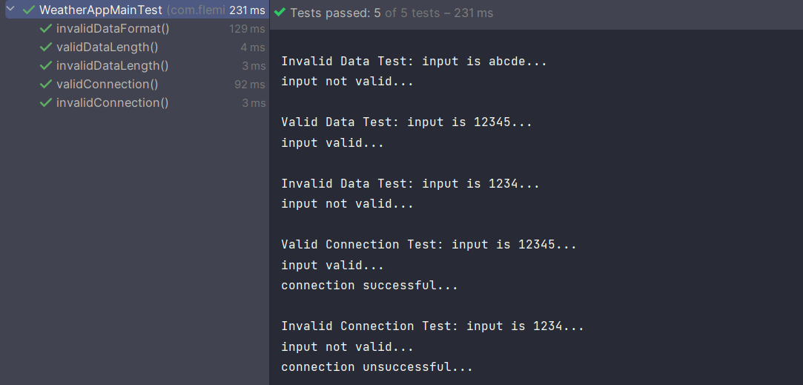

# CIT368 - Secure Software Development

This repository is s collection of assignments I developed in Java. 

## Weather Application

This assignment was done in two sets of commits. One where we just make a basic waether application using any weather API, and another where we apply secure software development practices. Due to the APi being leaked in the first version, the API key has been removed and regenerated. The secure practices implemented, include:
 - Application Partitioning
 - Input validation & Sanitation
 - Secrets
 - Error Handling
 - Static Code Testing (SAST)
 - Unit Testing
 - Logging
 - Software Bill of Materials (SBOM)

#### Static Code Analysis (SCA\SAST)

The tool I use was Qodana, an SCA tool that is prebundled with the Intellij IDE. The tool only found some performace issues, where I was usung concatination when appending to a `StringBuilder` object. The fix was to use multple `append()` calls instead of the concatination. Other warning incluse the use of some depricated functions and contructors, when using `Gson`. 

Qodana did not find any vulnerable dependencies as well. 

#### Software Bill of Materials (SBOM)

This application uses three dependencies: `Gson`, `junit`, and `junit-jupiter`. `Gson` is Google's Java JSON library, that allows the parsing and creation of JSON Objects or data. both `junit` and `junit-jupiter` re libraries for unit testing in Java. The dependency graph can be seen through the built-in system from GitHub, here: [CIT368 dependency Graph](https://github.com/Zack-Fleming/CIT368/network/dependencies)

#### Secrets

The weather application uses a class that is not version conttrolled, to store the API key and build the connection string. As stated above, a previous version of the software leaked the API key. This has been solved by rotating the keys. 

### Unit Testing

This application has a few unit tests for input and API connection validation. The tests for input validation test the utalized regex for length, format, and character set of the input. The tests of the API connection, tests rather the application only tries to connect with the API if it has valid data. The output of the tests is shown below.

